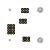

# AMUX01 - four channel analog multiplexer

A simple module based on the MAX4734. The MAX4734 has 4 analog channels, controlled by signals A0, A1 and EN. Supports power supply and signals in the range of 1.6-3.6 V.

    
